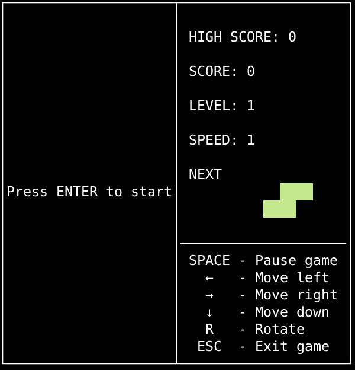
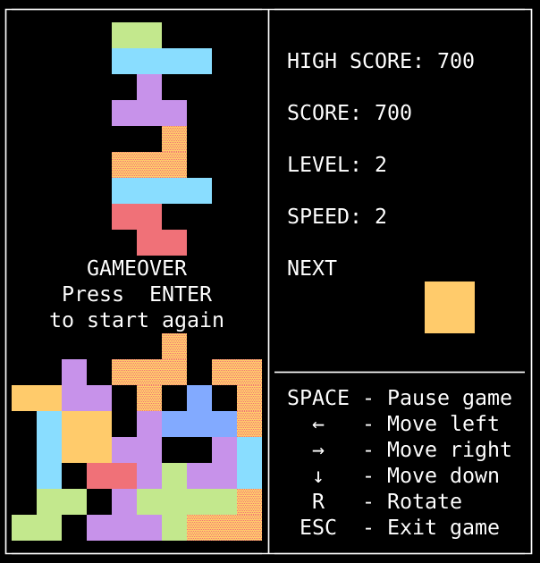

# BrickGame Тетрис

Проект в рамках базовой программы Школы 21. Школа 21 - образовательный проект от Сбер для разработчиков.

Представлена реализация игры Тетрис на С. Логика игры вынесена в отдельную библотеку. Библиотека подключается к GUI напрямую.
GUI представлен CLI исполнением (библиотека ncurses).
Библиотека игры покрыта юнит тестами.

## Требования

- pkg-config
- ncurses
- check
- gcovr
- doxygen

## Установка

Из папки `src` выполнить

```shell
make
```

Исполняемый файл в папке `src/build`:

- tetris_cli

## Скриншоты



